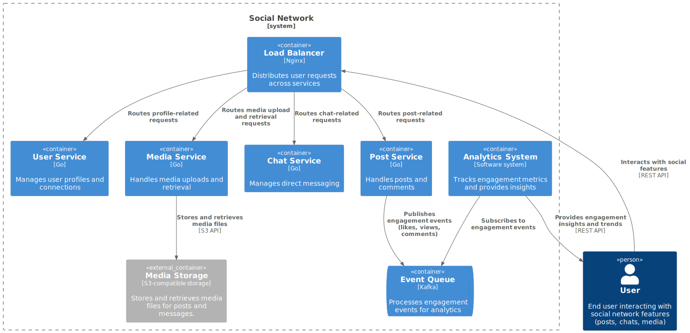
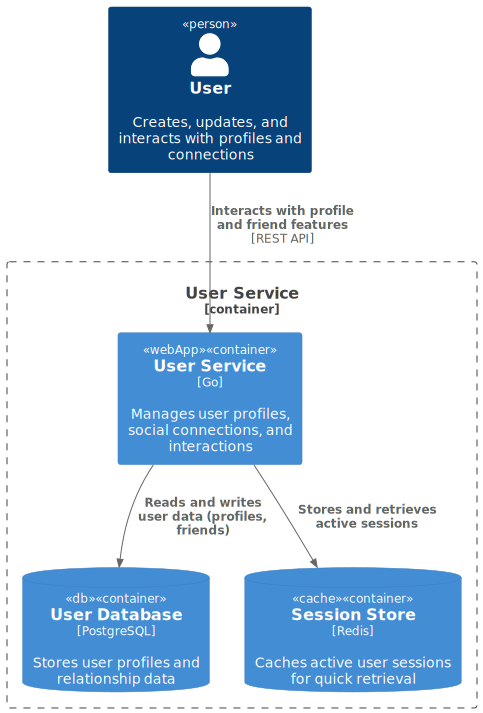
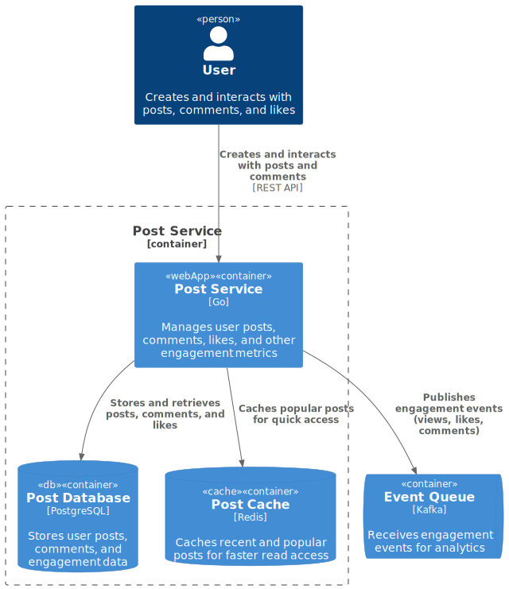
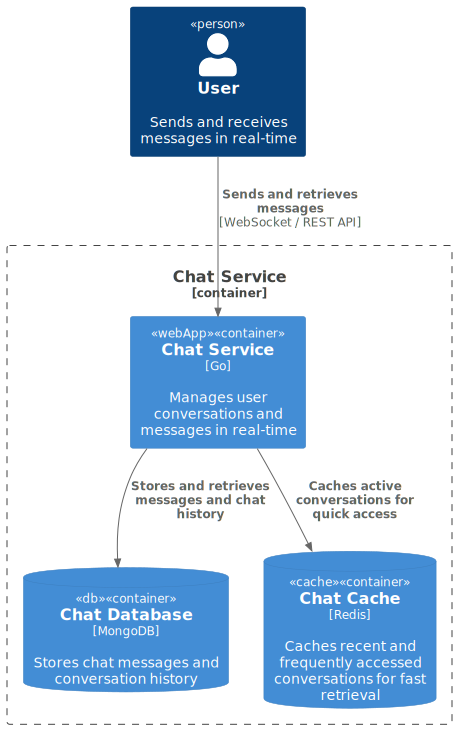
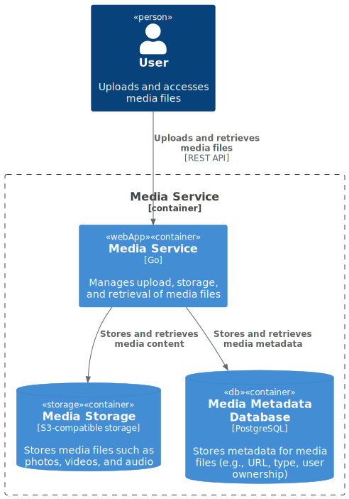
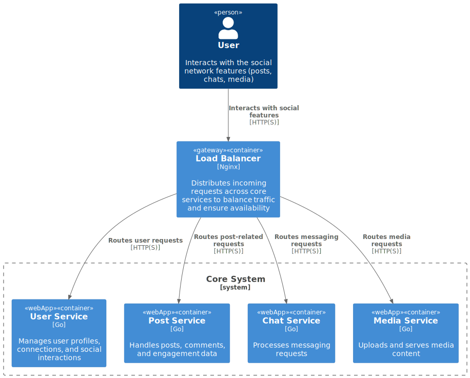
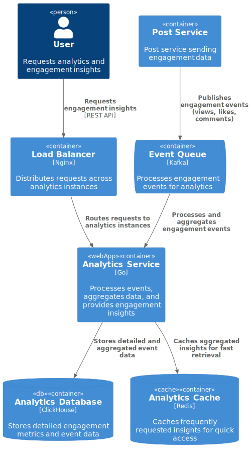

# Social Network - System Design

### Project Overview
This project demonstrates the design of a FB-like social network, covering user interactions, posts, messaging, and media upload features.

#### Functional Requirements
- Create, update, and view user profiles.
- Add/remove friends, view friend lists.
- Create, view, and delete posts with media support.
- Display personalized and user-specific feeds.
- Send, receive, and read messages in one-on-one chats.
- Upload and manage media files (photos, videos, audio).

#### Non-Functional Requirements
- Daily Active Users (DAU): 47 million.
- Availability: 99.9%.
- Latency: <500ms for feed retrieval and <200ms for messaging.
- RPS (Requests Per Second) estimates:
    Post creation: ~1306 RPS.
    Post read: ~6527 RPS.
- Data Retention: 5 years for posts, messages, and media.
- Scalability: Horizontal scaling, sharding for high-traffic components.
- Consistency:
    Strong consistency for profile updates and messages.
    Eventual consistency for likes, comments, and feed updates.

### Design Overview
The design follows the C4 model (https://c4model.com/) to represent system components and their interactions.

#### Level 1: System Context Diagram
The context diagram shows how users interact with the social network's core system and external services for media storage and analytics. This includes user interactions with social features and the data flow between core and supporting services.

  

#### Level 2: Container Diagrams for Core Components

Each core service is represented in its own container diagram, illustrating the internal and external interactions, databases, and caches where applicable.

##### User Service Container Diagram
Manages user profiles, social connections, and friend lists, providing a foundation for user-centric interactions.

  

##### Post Service Container Diagram
Handles posts, comments, and likes, with engagement metrics that are published to an external event queue for analytics.

  

##### Chat Service Container Diagram
Supports direct messaging between users, leveraging caching for active conversations and a database for persistent message storage.

  

##### Media Service Container Diagram
Manages the uploading and retrieval of media files, which are stored in an external S3-compatible storage.

  

##### Load Balancer
Distributes incoming requests from users across the system’s service instances, ensuring balanced loads and efficient processing.

  

##### Analytics Service Container Diagram
The Analytics System collects, processes, and aggregates engagement events (e.g., views, likes, comments) from the event queue. This system provides user insights and trends based on activity data, aiding in content personalization and engagement tracking.

  

#### Data Calculations

Database Size for Storing Messages (5 Years):
171.55 TB estimated for 5 years, with 47 million daily active users and 10 messages per user per day.

Incoming Traffic for Post Creation:
9.4 GB per day for posts, based on an average of 4.7 million daily posts with an average size of 2 KB.

Total Disk Requirements for 5 Years:
Messages: 171.55 TB
Posts: 12.85 TB
Total: ~185 TB

Request Per Second (RPS) Estimates:
Reading Posts: ~6527 RPS during peak hours.
Creating Posts: ~1306 RPS during peak hours.